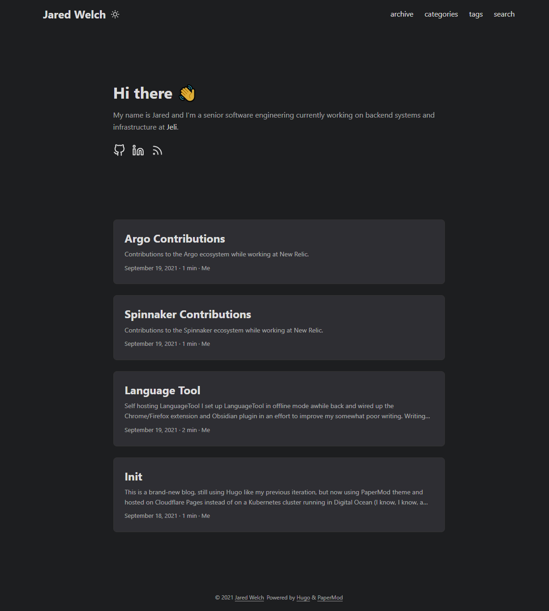

+++
title = "I forgot how things work"
date = 2022-12-22
+++

Or, how to redo your personal site (again) in an evening. 

I took off yesterday and today to get a long weekend before being on call over the Xmas weekend. Around 7pm today I got bored and decided I should finally write something for my blog, which I have not touched in a year, only to find that I have no idea how to publish a new post. Shame on past me for not writing a single line of instructions, docs, reminders, anything. 

After some digging, I figured out that I used Hugo with a theme called Papermod. The site looks pretty good right now actually! 

In the past year my taste in web design has shifted a bit. This theme is over-complicated with too many features and looks, if we're being honest, way too nice. I'm not and will probably never be a frontend engineer who actually knows how to make a site and make it look good. 

So, instead of trying to remember how Hugo works (archetypes? what the heck is that?), I decided to ditch it and try Zola, which seems more my speed. 

Starting looks [pretty simple](https://www.getzola.org/documentation/getting-started/overview/) so I fired up a gitpod (also new to me!) and started poking around. First step was to install zola, which I did by just grabbing a binary from the Github releases. Gotta love statically linked binaries for tools. I dumped my old site content into a backup folder so I can grab content later and then followed the zola quick start. 

I ran `zola init site` in the root of my repo, also called `site`. This created a sub directory, which I don't want, so I pulled the files up one level. Running `zola serve` let me access the site on port 1111. The way Gitpod and VSCode handle local ports is pretty cool, but it took some wrangling to get everything working together. By default, none of the images or assets were loading. The magic incantation seems to be `zola serve -p 8080 -u / -i 0.0.0.0` which ensures that relative links for styles and assets resolve correctly on the Gitpod magic hostname. 

I grabbed the example content from the theme I'm using, [hook](https://github.com/InputUsername/zola-hook) to serve as a starting point. Porting posts over from Hugo was pretty easy. Zola uses TOML-flavored frontmatter instead of YAML. Easy fix. Zola supports colocation of assets, so I just had to tweak some image links and drop the files in the directory as the `index.md` for a post. 

The theme I'm using is a little opinionated, so I'll probably be making some tweaks. It seems designed to build a small blog, which is great. But I want to make a Today I Learned section that has it's own posts and organization. That's probably next on the TODO list. There's a stub section and post, but the same archive listing that the blog section uses is not quite right. 

So far, Zola is pretty easy to use. I definitely struggled with the configuration a lot more with Hugo and the various complicated themes I tried last year. 

And this time, I'll write a damn readme so next year I can avoid doing this again. Maybe. 