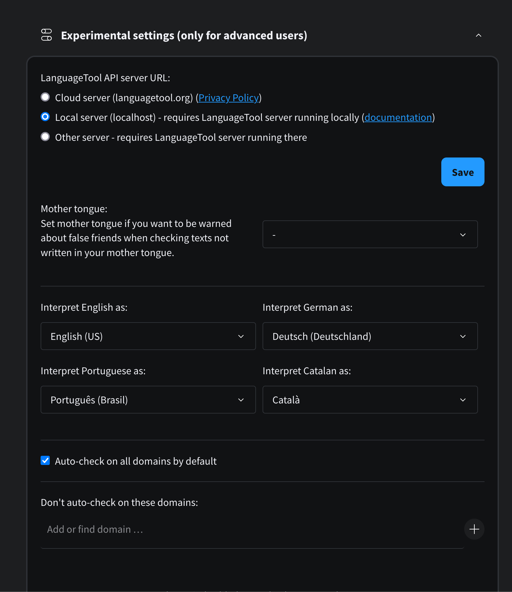
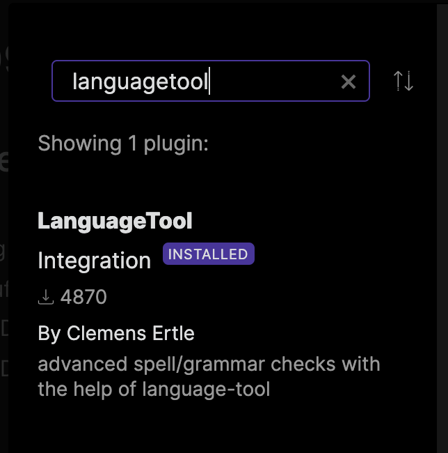
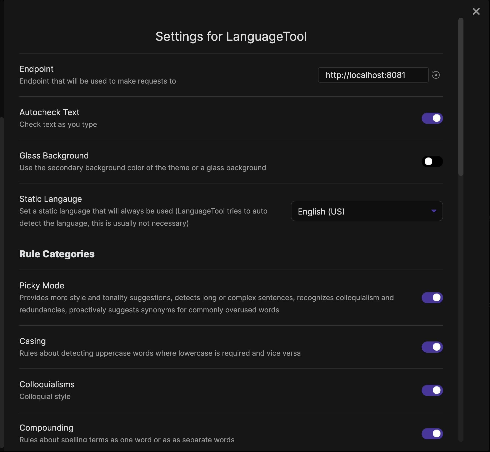

# Self hosting LanguageTool

I set up [LanguageTool](https://languagetool.org/) in offline mode awhile back and wired up the Chrome/Firefox extension and Obsidian plugin in an effort to improve my somewhat poor writing. 
Writing has never been my strong suit nor of particular interest to me, and so I've always leaned on tools to help me through it. 

> Fun fact, I used the corrections like 10 times while writing this post. 

Most grammar tools are privacy nightmares so when I found out you can self-host the open source server for LanguageTool I had to take a few minutes to give it a try. 
I have documented the steps below in case anyone else is interested. 

1. Install the server `brew install languagetool`
2. [Setup n-gram data](https://dev.languagetool.org/finding-errors-using-n-gram-data)
3. Install fasttext for much better language recognition. 
    1. Binary: https://fasttext.cc/docs/en/support.html
    2. Prebuilt model: https://fasttext.cc/docs/en/language-identification.html
    3. I dropped the model in a directory alongside the n-gram data

4. Create a config file. I made a directory in `$HOME` called `.language-tool` and dropped the config, n-grams, and fasttext binary in there. 

```
$HOME/.language-tool
|- languagetool.cfg
|- lid.176.bin
|- en
   |- 1grams
   |- 2grams
   |- 3grams
```
Contents of `$HOME/.language-tool/languagetool.cfg`
```properties
fasttextBinary=/usr/local/bin/fasttext
fasttextModel=/Users/jwelch/.languagetool-config/lid.176.bin
languageModel=/Users/jwelch/.languagetool-config/
```

5. Create a script to start up the server (plist nonsense follow up planned for later)

```bash
#!bin/bash

languagetool-server --port 8081 --allow-origin "*" --config /Users/jwelch/.languagetool-config/languagetool.cfg
```

6. Install the Chrome extension and configure the server address to be localhost instead of their public API.


7. Profit from spelling and grammar checking everywhere!

## Addendum

I also installed the [Obsidian plugin](https://github.com/Clemens-E/obsidian-languagetool-plugin) so that I can write in Obsidian and still get support from LanguageTool. 
It recently added an automatic mode that sends deltas to the language server and provides fast feedback much like the tools on other platforms. 

Add the plugin


And configure it to use localhost server address

